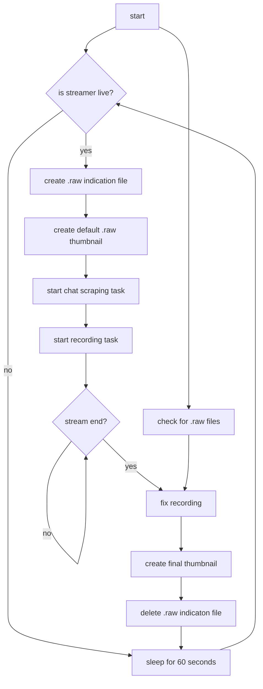

# 🎥 twitchrecorder

[](https://github.com/ThirtySix361/twitchrecorder)
[](https://github.com/ThirtySix361/twitchrecorder)
[](https://github.com/ThirtySix361/twitchrecorder)
[](https://hub.docker.com/r/thirtysix361/twitchrecorder)
[](https://hub.docker.com/r/thirtysix361/twitchrecorder)

[](mailto:dev@36ip.de)


---

this container lets you download any twitch stream by giving a simple twitch channel name as parameter.

[](https://36ip.de/twitchrecorder/)

---

## 🌐 links

[source code](https://github.com/ThirtySix361/twitchrecorder) \
[live demo](https://36ip.de/twitchrecorder/)

---

## 🔗 dependencies

+ docker

---

## 🚀 quick start

step 1.

```bash
git clone https://github.com/ThirtySix361/twitchrecorder.git
cd twitchrecorder
```

step 2.

```bash
bash build.sh
```

step 3.

```bash
bash run.sh <twitchchannelname>
```

perform `step 3` for each streamer you want to record.

for example:

```bash
bash run.sh shroud
bash run.sh ninja
bash run.sh pewdiepie
bash run.sh montanablack88
```

>//<br>//<samp> 💡 optionally point your webserver with php interpreter to the `mounts/` directory </samp><br>//

---

## 🧠 general informations

this container will scan every minute if the given streamer has started streaming. if so, it will start recording the stream.

if container breaks, shuts down, is killed or has no more internet connection, the captured file will not be corrupted. you will still be able to play it!

on common stream ending, the container will perform a fix on the final `.mp4` file, which will move the header information (which includes also the final length of file) to the begin. this has to do with the way the `.mp4` is written while the stream is running.

all header information are stored at the begin of the file which is uncommon. but only by this way it is possible to have a working file after crash or forceful shutdown of the container and its inner capturing software.

>//<br>//<samp> 💡 the `.mp4` files are stored in the `mounts/archive/<channelname>/` directory </samp><br>//

---

## 🧐 troubleshooting

in case a container was forcefully killed, just re-deploy the container for the given streamer.
it will autofix the files which did not graceful finished.

this can take a while on huge files.

---

## flowchart



---

## 📝 todo list

- [x] container
    - [x] runs as user instead of root
    - [x] allowing multiple instances at same time for unlimited parallel recordings
    - [x] proper logging
- [ ] recordings
    - [x] autodetect if streamer started streaming and start recording
    - [x] make file playable even if the streamer is still streaming and file is still being written
    - [x] prevent file from beeing corrupted after container shutdown while file is still being written
    - [x] autofix final .mp4 file on stream end
        - [x] autofix unfinished files on container startup
    - [x] take thumbnail from final .mp4 on stream end
    - [x] capture chat into textfile
        - [ ] capture twitch emotes
    - [ ] improve live playback
- [x] webpage
    - [x] list every video file from archive (order by filename)
        - [x] filter videos by streamer
    - [x] display filename and filesize
    - [x] delete video button
        - [x] remove empty directorys
        - [x] remove last time position
    - [x] video navigation buttons
    - [x] save last time position to localstorage
    - [x] load last time position on open
    - [x] display chat next to the video
        - [x] sync chat with video
    - [x] release a demo version
    - [x] improve responsive design especially for mobile
    - [x] redesign webpage
