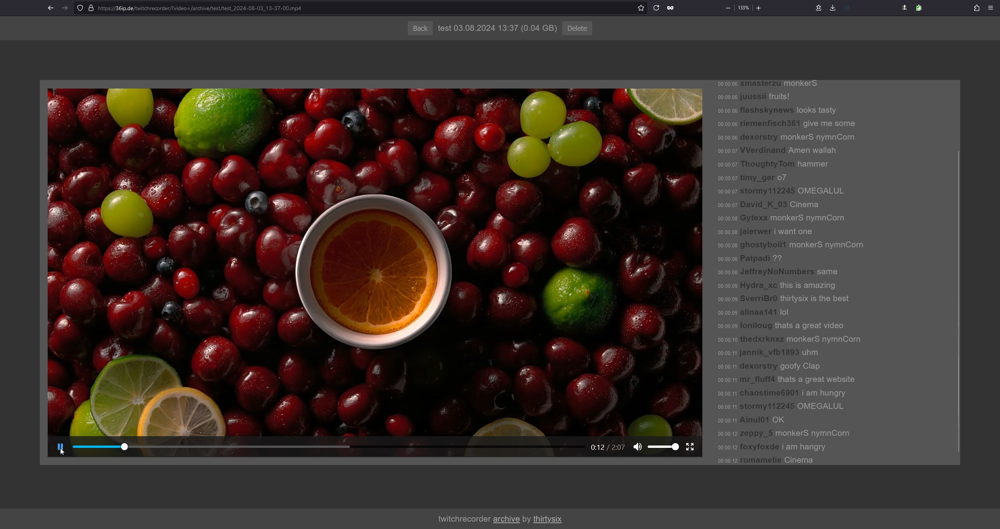

# twitchrecorder

[](mailto:dev@36ip.de)


[](https://github.com/ThirtySix361/twitchrecorder?tab=readme-ov-file)
[](https://github.com/ThirtySix361/twitchrecorder?tab=readme-ov-file)
[](https://github.com/ThirtySix361/twitchrecorder?tab=readme-ov-file)
[](https://hub.docker.com/r/thirtysix361/twitchrecorder)
[](https://hub.docker.com/r/thirtysix361/twitchrecorder)

<hr>

this container lets you download any twitch stream by giving a simple twitch channel name as parameter.



## dependencies

+ docker

## quick start

step 1.

```bash
git clone https://github.com/ThirtySix361/twitchrecorder.git
cd twitchrecorder
```

step 2.

```bash
bash build.sh
```

step 3.

```bash
bash run.sh <twitchchannelname>
```

perform `step 3` for each streamer you want to record.

for example:

```bash
bash run.sh shroud
bash run.sh ninja
bash run.sh pewdiepie
bash run.sh montanablack88
```

>//<br><samp>💡 optionally point your webserver with php interpreter to the `mounts/` directory </samp><br>//

## general informations

this container will scan every 5 minutes if the given streamer has started streaming. \
if so, it will start recording the stream.

if the streamer stopped streaming, the container will perform another check after 60 seconds, in case the streamer just had a disconnect and restarts the stream, you will not miss full 5 minutes of the stream.

if container breaks, shutdown, is killed or has no more internet connection, the captured file will not be corrupted. you will still be able to play it!

on common stream ending, the container will perform a fix on the final `.mp4` file, which will move the header information (which includes also the final length of file) to the begin. this has to do with the way the `.mp4` is written while the stream is running.

all header information are stored at the begin of the file which is uncommon. but only by this way it is possible to have a working file after crash or forceful shutdown of the container and its inner capturing software.

## troubleshooting

in case a container was forcefully killed and you want to fix the files, use `fix` as second parameter:

for example:

```bash
bash run.sh shroud fix
bash run.sh ninja fix
bash run.sh pewdiepie fix
bash run.sh montanablack88 fix
```

or set this environment variable in the container:

```bash
startupfix="fix"
```

this will fix all files for a streamer on startup, which can take a while.
