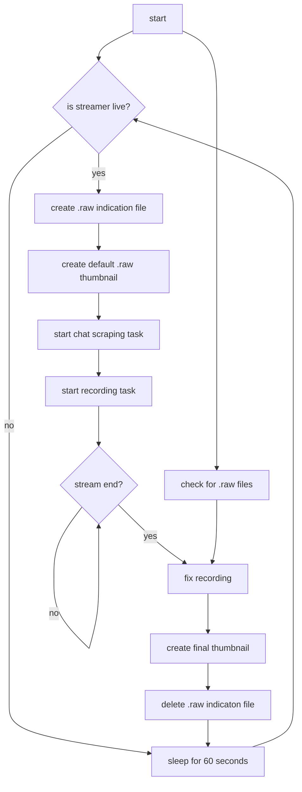

<div align="center">

[](https://github.com/ThirtySix361/twitchrecorder)
[](https://github.com/ThirtySix361/twitchrecorder)
[](https://github.com/ThirtySix361/twitchrecorder/actions/workflows/docker.yml) <br>
[](https://github.com/ThirtySix361/twitchrecorder/stargazers)
[](https://hub.docker.com/r/thirtysix361/twitchrecorder)
[](https://hub.docker.com/r/thirtysix361/twitchrecorder) <br>
[](mailto:dev@36ip.de)
[](https://discord.com/users/323043165021929482)

</div>

# 🎥 twitchrecorder

<div align="center">

this container lets you download any twitch stream by giving a simple twitch channel name as parameter.

[](https://github.com/ThirtySix361/twitchrecorder/)

</div>

## 🌐 links

[source code](https://github.com/ThirtySix361/twitchrecorder)

## 🔗 dependencies

docker

## 🚀 quick start

step 1.

```bash
git clone https://github.com/ThirtySix361/twitchrecorder.git
cd twitchrecorder
```

step 2.

```bash
docker pull thirtysix361/twitchrecorder
```

step 3.

```bash
bash run.sh
# default port is: 8081
# or for custom port use:
bash run.sh <port>
```

then acceess the webpage through your browser on `http://localhost:<port>`

## 🧠 general informations

<div align="center">

[](https://github.com/ThirtySix361/twitchrecorder/)

</div>

>//<br>//<samp> 💡 the `.mp4` files are stored in the `mounts/archive/<channelname>/` directory </samp><br>//

## 🧐 troubleshooting

in case a container was forcefully killed, just re-deploy the container.
it will autofix the files which did not graceful finished.

this can take a while on huge files, depending on your used hardware.

## 🌊 flowchart



## 📝 todo list
- [x] container
    - [x] runs as user instead of root
    - [x] allowing multiple instances at same time for unlimited parallel recordings
    - [x] proper logging
- [x] recordings
    - [x] autodetect if streamer started streaming and start recording
    - [x] make file playable even if the streamer is still streaming and file is still being written
    - [x] prevent file from beeing corrupted after container shutdown while file is still being written
    - [x] autofix final .mp4 file on stream end
        - [x] autofix unfinished files on container startup
    - [x] take thumbnail from final .mp4 on stream end
    - [x] capture chat into textfile
        - [x] capture twitch emotes
    - [x] improve live playback
        - [x] capture stream with hls and .m3u8
    - [x] remove all advertisements by twitch from the stream
- [x] webserver
    - [x] add an optional webserver-container for the webpage
    - [x] remove the separate webserver-container and implement it directly into the recorder-container
- [x] webpage
    - [x] list every video file from archive (order by filename)
        - [x] filter videos by streamer
    - [x] display filename and filesize
    - [x] delete video button
        - [x] remove empty directorys
        - [x] remove last time position
    - [x] video navigation buttons
    - [x] save last time position to localstorage
    - [x] load last time position on open
    - [x] display chat next to the video
        - [x] sync chat with video
    - [x] release a demo version
    - [x] improve responsive design especially for mobile
    - [x] redesign webpage
    - [x] implement hls for live-playback
    - [x] add recording-task-management page to webpage
